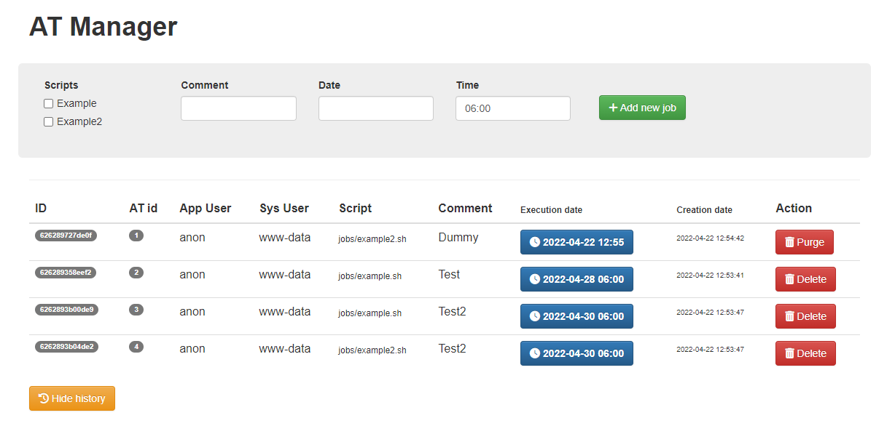

# AT MANAGER

0. About

This is a small GUI on top of `at`.

1. Installation
```bash
make init && nano config.php
```

2. Usage

- Just write some scripts in jobs/ directory
- Schedule your newly added scripts from the UI

# Preview


